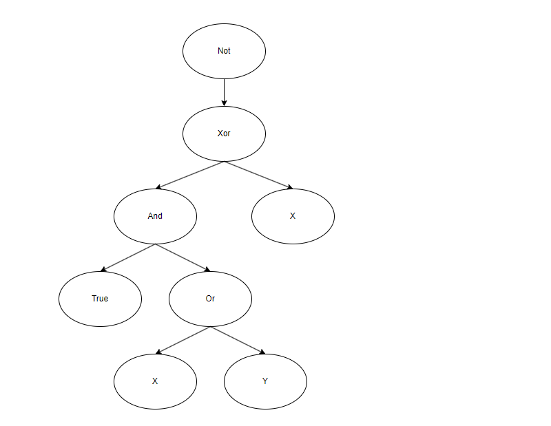
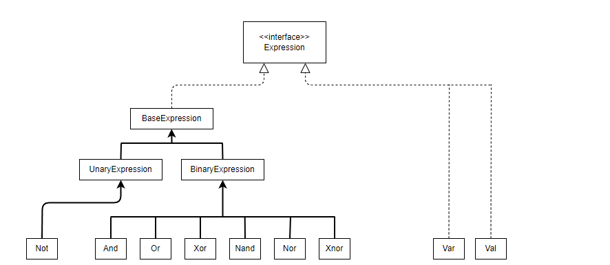
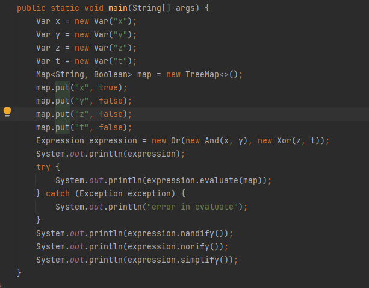
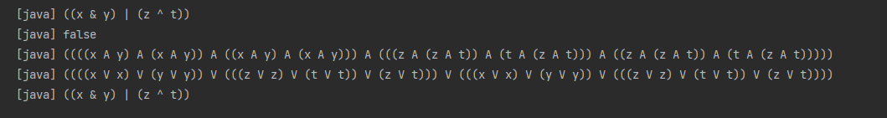

# Math Expressions Interpreter 
## General Information
This program represents nested logical expressions with variables, evaluates their values
for specific variable assignments, and simplifies the results.

Basically, it's a program that interprets logical expressions.<br>
It can be used to:

* Automatically differentiate and simplify expressions using logic gates.
* Evaluate expressions.
* obtain expression's variables.
* Perform procedures on the expression such as - nandify, norify, etc.


```
Expression e = new Not(
                  new Xor(
                     new And(
                        new Val(true),
                        new Or(
                           new Var("x"),
                           new Var("y")
                        )
                     ),
                     new Var("x")
                  )
               );
```
The "tree" of the expression will look like: <br> <br>


<br>
<br>In this project I worked with the following UML diagram to compute the expressions: <br>

<br>



## Examples
First, the string representations are as follows:
* And(x,y) = (x & y)
* Or(x,y) = (x | y)
* Xor(x,y) = (x ^ y)
* Nand(x,y) = (x A y)
* Nor(x,y) = (x V y)
* Xnor(x,y) = (x # y)
* Not(x) = ~(x)

Here we can see the code example: 
<br>
<br>

<br> 
<br>
We compute the expression ((x and y) or (z xor t))
<br> 
When the assignments of the variables are ```x=true, y=false, z=false, t=false ```.
And then we compute the nandify and norify form of the expression and at the end we simplify the expression if we can.<br>
The simplifications supported are:
* x & 1 = x
* x & 0 = 0

* x & x = x
* x | 1 = 1
* x | 0 = x
* x | x = x
* x ^ 1 = ~(x)
* x ^ 0 = x
* x ^ x = 0
* x A 1 = ~(x)
* x A 0 = 1
* x A x = ~(x)
* x V 1 = 0
* x V 0 = ~(x)
* x V x = ~(x)
* x # x = 1 <br>
Where x is a variable or an expression 
<br>
The result is




## Setup
### Option 1 - Without Ant
1. Clone the repository:

```
git clone https://github.com/EtaiWil/Math_Expressions_Interpreter.git
```
2. Open the project from an IDE such as Intellij, Eclipse, etc.
3. Make sure an updated JDK is set in the configuration, and the src folder of Math-Expressions-Interpreter is set as the source root.
4. Create a configuration with ExpressionsTest as the Main Class, run it, and enjoy!

### Option 2 - With Ant
1. Clone the repository:
  ```
git clone https://github.com/EtaiWil/Math_Expressions_Interpreter.git
```
2. Install [Apache Ant](https://ant.apache.org/bindownload.cgi)

   If you're having difficulties with the Ant installation proccess, you can click [here](https://www.youtube.com/watchv=3eaW81yYIqY&t=353s&ab_channel=xscourse) for help.

<br /> 

3. Open CMD in the cloned directory and run this command:
    ```
    ant run
    ```

## Built with

- Java


## Author

**Etai Wilentzik**

- [Profile](https://github.com/EtaiWil )
- [Email](mailto:etaiwil2000@gmail.com?subject=Hi "Hi!")
- [LinkedIn](https://www.linkedin.com/in/etai-wilentzik-b5a106212/ "Welcome")

## Support 🤝

Contributions, issues, and feature requests are welcome!

Give a ⭐️ if you like this project!

